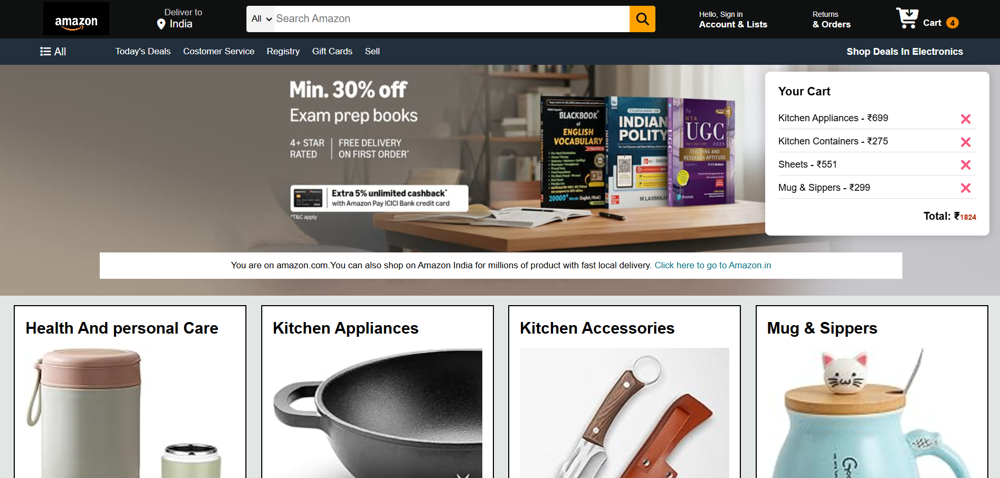
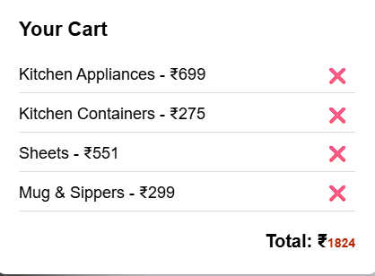

# Amazon Clone 🛒

A responsive Amazon clone built using HTML, CSS, and JavaScript with interactive cart functionality.

## 🔥 Features
- Add to Cart and Remove from Cart functionality
- Dynamic cart total price calculation
- Cart data persistence using localStorage
- Interactive UI using JavaScript DOM manipulation
- Responsive layout

- ## 📸 Screenshots

### 🏠 Home Page

### 🛒 Cart Page

## 🛠️ Tech Stack
- HTML
- CSS
- JavaScript

## 🚀 How to Run the Project
1. Clone the repository  
   git clone https://github.com/Ishant-02/amazon-clone.git
2. Open index.html in your browser

## 📂 Project Structure
amazon-clone/
├── index.html
├── style.css
├── script.js
└── assets/

## 👨‍💻 Author
**Ishant Shukla**  
GitHub: https://github.com/Ishant-02  
LinkedIn: https://www.linkedin.com/in/ishant-shukla-0160bb2a2
